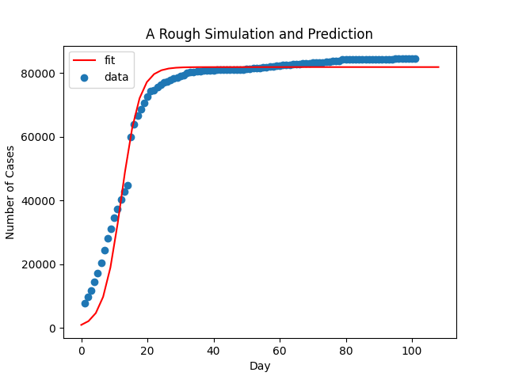

# 代码使用方法

* 运行[爬虫完整处理.py](爬虫完整处理.py)生成疫情数据
* 运行[绘制地图.py](绘制地图.py)绘制疫情地图

> 输入：日期  
> 输出：对应日期的疫情地图，如超出疫情日期范围，则生成最近日期的地图

* 运行[折线图.py](折线图.py)生成中国整体疫情折线图

> 前置：需要运行爬虫完整处理中的**获取全国数据部分**

* 运行[预测曲线.py](预测曲线.py)生成预测曲线，预测图需要手动在代码中改变数据

> 前置：需要运行爬虫完整处理中的**获取全国数据部分**

* 运行[词云图.py](词云图.py)生成词云图

> 前置：需要运行爬虫完整处理中的**获取各省份最新数据部分**

* 运行[爬腾讯新闻.py](爬腾讯新闻.py)生成最新新闻CSV文件

> 如需要更多新闻，则需要改变代码，目前只生成**20条新闻**，在*2021-08-23 11:12*观测，**最多**可获取**90条新闻**
